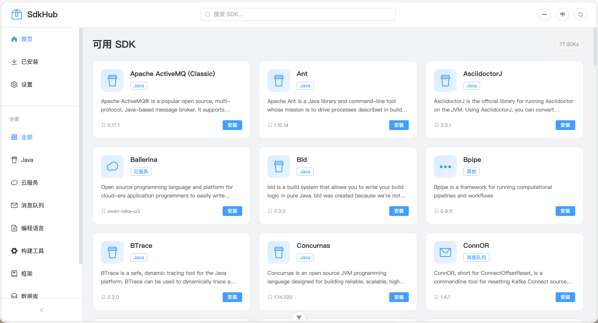
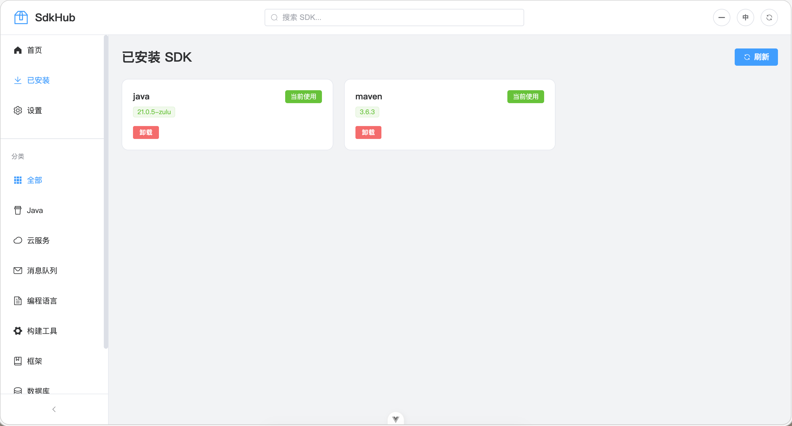
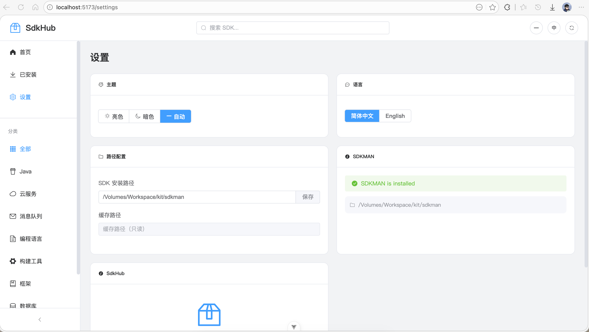

# SdkHub - 现代化 SDK 管理工具

<p align="center">
  
</p>

<p align="center">
  
  
  
  
  
  
</p>

<p align="center">
  <b>一款基于 Vue 3 + Spring Boot + Tauri 构建的现代化 SDK 管理工具</b>
</p>

## 📸 应用截图

### 首页 - SDK 列表

<p align="center">
  
</p>

### 已安装页面

<p align="center">
  
</p>

### 设置页面

<p align="center">
  
</p>

## ✨ 功能特性

- 🎨 **现代化 UI** - 采用 Vue 3 + Element Plus，卡片式布局，界面美观流畅
- 🖥️ **桌面应用** - 基于 Tauri 构建跨平台桌面应用，支持 macOS/Windows/Linux
- 🌍 **国际化支持** - 支持中英文切换，自动检测系统语言偏好
- 🌗 **主题切换** - 支持亮色/暗色/自动三种主题模式，自动跟随系统
- 📦 **SDK 管理** - 浏览、安装、卸载、切换 SDK 版本，基于 SDKMAN
- 🔍 **搜索过滤** - 快速搜索 SDK 名称、ID 或描述
- 🏷️ **分类浏览** - 按类别查看 SDK（Java、构建工具、编程语言、框架等）
- ⚙️ **配置管理** - 支持修改 SDK 安装路径等配置
- 🚀 **内嵌后端** - 打包后无需单独启动后端服务

## 🚀 技术栈

### 前端 (sdkhub-ui/)

- **Vue 3** - 渐进式 JavaScript 框架
- **TypeScript** - 类型安全的 JavaScript 超集
- **Element Plus** - 基于 Vue 3 的组件库
- **Pinia** - Vue 状态管理方案
- **Vue Router** - Vue.js 路由管理器
- **Vue I18n** - 国际化插件
- **Axios** - HTTP 客户端
- **Vite** - 构建工具
- **Tauri 2** - 跨平台桌面应用框架

### 后端 (src/main/java/)

- **Java 21** - 最新的 Java LTS 版本
- **Spring Boot 4.0** - 快速开发框架
- **Lombok** - 简化 Java 代码的工具
- **Hutool** - Java 工具类库
- **Maven** - 项目构建工具

## 📦 项目结构

```
SdkHub/
├── src/main/java/com/yuchang/sdkhub/    # Java 后端代码
│   ├── controller/                      # REST API 控制器
│   │   ├── SdkController.java           # SDK 管理接口
│   │   └── ConfigController.java        # 配置管理接口
│   ├── service/                         # 业务逻辑层
│   │   └── SdkmanService.java           # SDKMAN 服务封装
│   ├── config/                          # 配置类
│   │   ├── SdkHubProperties.java        # 应用配置属性
│   │   └── CorsConfig.java              # CORS 跨域配置
│   ├── dto/                             # 数据传输对象
│   ├── vo/                              # 视图对象
│   └── SdkHubApplication.java           # 应用入口
├── src/main/resources/
│   └── application.yaml                 # 应用配置文件
├── sdkhub-ui/                           # Vue 3 前端项目
│   ├── src/
│   │   ├── api/                         # API 接口封装
│   │   ├── components/                  # 公共组件
│   │   ├── views/                       # 页面视图
│   │   ├── stores/                      # Pinia 状态管理
│   │   ├── locales/                     # 国际化文件
│   │   ├── router/                      # 路由配置
│   │   └── types/                       # TypeScript 类型定义
│   ├── src-tauri/                       # Tauri 桌面应用配置
│   │   ├── src/                         # Rust 源代码
│   │   ├── binaries/                    # 内嵌后端 JAR
│   │   └── tauri.conf.json              # Tauri 配置
│   ├── package.json
│   └── vite.config.ts
├── docs/                                # 文档和截图
│   ├── 128x128.png                      # 应用图标
│   ├── home.jpg                         # 首页截图
│   ├── installed.jpg                    # 已安装页面截图
│   └── setting.jpg                      # 设置页面截图
├── pom.xml                              # Maven 配置
└── README.md
```

## 🛠️ 开发环境

### 前置要求

- **Node.js** >= 20.19 或 >= 22.12
- **Java** >= 21
- **Maven** >= 3.8
- **Rust** >= 1.87（构建桌面应用需要）
- **SDKMAN** - 用于管理 SDK（可选，但推荐安装）

### 安装依赖

```bash
# 1. 安装前端依赖
cd sdkhub-ui
npm install

# 2. 安装后端依赖（在根目录）
cd ..
mvn clean install
```

### 开发模式

#### Web 模式

需要同时启动前端和后端服务：

```bash
# 终端 1：启动前端开发服务器
cd sdkhub-ui
npm run dev

# 终端 2：启动 Java 后端（在项目根目录）
mvn spring-boot:run
```

访问地址：

- 前端：http://localhost:5173
- 后端 API：http://localhost:8080

#### Tauri 桌面应用模式

```bash
# 终端 1：启动后端（开发时需要）
mvn spring-boot:run

# 终端 2：启动 Tauri 开发模式
cd sdkhub-ui
npm run tauri:dev
```

### 构建生产版本

#### Web 版本

```bash
# 构建前端
cd sdkhub-ui
npm run build

# 构建后端（包含前端静态资源）
cd ..
mvn clean package
```

#### 桌面应用版本

```bash
# 1. 构建 JAR
mvn clean package -DskipTests

# 2. 复制 JAR 到 Tauri 资源目录
cp target/SdkHub-0.1.0.jar sdkhub-ui/src-tauri/binaries/

# 3. 构建 Tauri 应用
cd sdkhub-ui
npm run tauri:build
```

构建产物位于 `sdkhub-ui/src-tauri/target/release/bundle/`

## 📡 API 接口

### SDK 管理

| 接口        | 方法   | 路径                            | 说明             |
|-----------|------|-------------------------------|----------------|
| 获取所有 SDK  | GET  | `/api/sdks`                   | 获取可用 SDK 列表    |
| 获取 SDK 版本 | GET  | `/api/sdks/{sdkId}/versions`  | 获取指定 SDK 的所有版本 |
| 安装 SDK    | POST | `/api/sdks/{sdkId}/install`   | 安装指定版本的 SDK    |
| 卸载 SDK    | POST | `/api/sdks/{sdkId}/uninstall` | 卸载指定版本的 SDK    |
| 切换版本      | POST | `/api/sdks/{sdkId}/use`       | 临时切换到指定版本      |
| 设置默认      | POST | `/api/sdks/{sdkId}/default`   | 设置默认版本         |
| 已安装列表     | GET  | `/api/sdks/installed`         | 获取已安装的 SDK     |
| 当前版本      | GET  | `/api/sdks/{sdkId}/current`   | 获取当前使用的版本      |
| SDKMAN 状态 | GET  | `/api/sdks/status`            | 检查 SDKMAN 安装状态 |

### 配置管理

| 接口         | 方法   | 路径                        | 说明        |
|------------|------|---------------------------|-----------|
| 获取配置       | GET  | `/api/config`             | 获取当前配置    |
| 批量更新配置     | PUT  | `/api/config`             | 批量更新配置    |
| 更新 SDK 路径  | PUT  | `/api/config/sdk-path`    | 更新 SDK 路径 |
| 更新缓存路径     | PUT  | `/api/config/cache-path`  | 更新缓存路径    |
| 更新自动检查更新设置 | PUT  | `/api/config/auto-check-update` | 更新自动检查设置  |

## 📝 使用说明

### 首页 - SDK 列表

- 浏览所有可用的 SDK，以卡片形式展示
- 左侧边栏按分类筛选（Java、编程语言、构建工具等）
- 顶部搜索栏可搜索 SDK 名称、ID 或描述
- 点击 SDK 卡片查看版本详情，进行安装/卸载/切换操作

### 已安装页面

- 查看已安装的 SDK 列表
- 快速切换当前使用的版本
- 卸载不需要的版本

### 设置页面

- **主题设置**：切换亮色/暗色/自动主题
- **语言设置**：切换中文/英文界面
- **路径配置**：修改 SDK 安装路径、缓存路径
- **更新设置**：配置自动检查更新
- **SDKMAN 状态**：查看 SDKMAN 安装状态
- **关于**：查看应用版本信息

## 🔧 配置说明

### 后端配置 (application.yaml)

```yaml
sdkhub:
  # SDK 安装路径（默认 ~/.sdkman）
  sdk-path: ~/.sdkman
  # 缓存路径
  cache-path: ~/.sdkhub/cache
  # 自动检查更新
  auto-check-update: true

server:
  port: 8080
```

### 前端配置

前端配置文件位于 `sdkhub-ui/src/locales/`，可添加新的语言支持：

- `zh-CN.ts` - 简体中文
- `en-US.ts` - English

## 🤝 贡献指南

欢迎提交 Issue 和 Pull Request！

1. Fork 本仓库
2. 创建功能分支 (`git checkout -b feature/AmazingFeature`)
3. 提交更改 (`git commit -m 'Add some AmazingFeature'`)
4. 推送到分支 (`git push origin feature/AmazingFeature`)
5. 创建 Pull Request

## 📄 许可证

本项目采用 [MIT](LICENSE) 许可证开源。

## 🙏 致谢

- [SDKMAN!](https://sdkman.io/) - 灵感来源和底层工具
- [Vue.js](https://vuejs.org/) - 前端框架
- [Element Plus](https://element-plus.org/) - UI 组件库
- [Spring Boot](https://spring.io/projects/spring-boot) - 后端框架
- [Tauri](https://tauri.app/) - 桌面应用框架

---

<p align="center">
  Made with ❤️ by SdkHub Team
</p>
